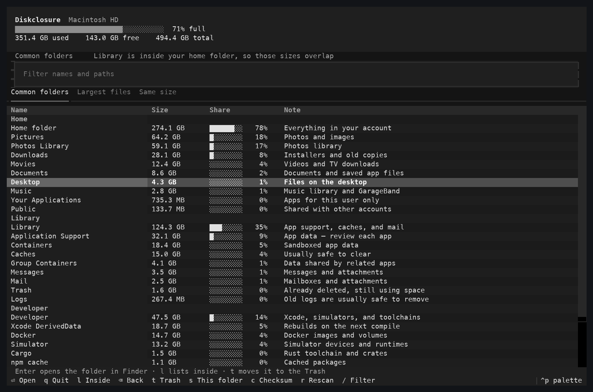
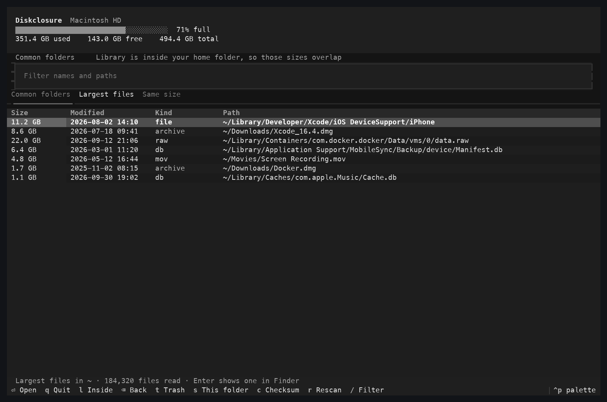
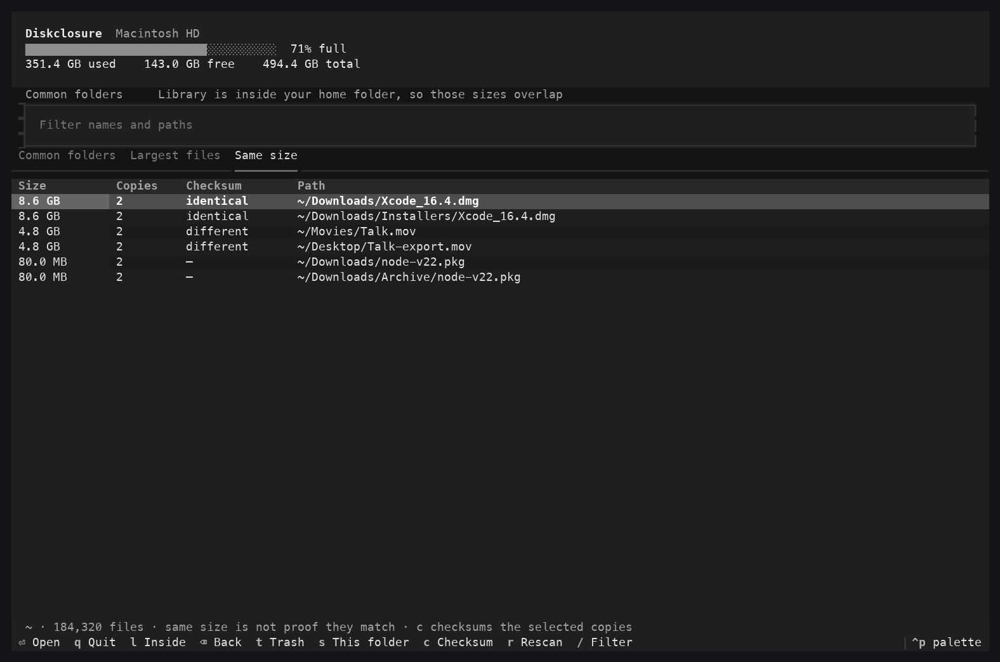
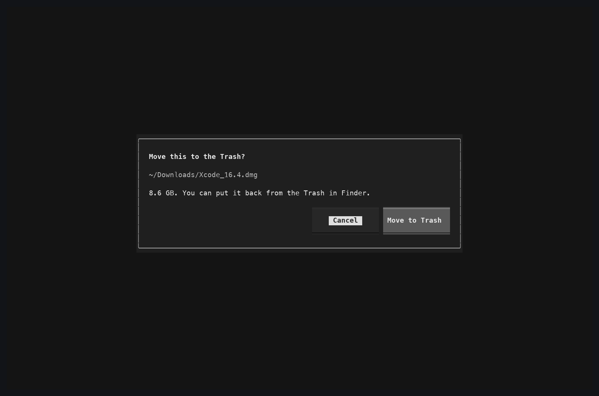

# Diskclosure

Diskclosure is a terminal program for seeing what is using space on a Mac. It lists the usual folders, the largest files, and copies that share a size. Enter opens the selection in Finder. Anything you remove goes to the Trash, and only after you confirm.

The pictures show the real interface. The folder and file names in them are examples, so this repository does not contain a listing of anyone's personal files. The disk summary at the top is from the Mac that rendered the picture.



## Install

Diskclosure runs on macOS and needs Python 3.11 or newer.

[pipx](https://pipx.pypa.io/) installs it as its own command:

```bash
pipx install git+https://github.com/anuwrag/diskclosure.git
diskclosure
```

From a clone of this repository:

```bash
pipx install .
diskclosure
```

Or, inside a virtual environment:

```bash
python3 -m venv .venv
.venv/bin/pip install -e .
.venv/bin/diskclosure
```

## How to use it

The first screen is **Common folders**. Sizes fill in while your home folder is measured. That walk can take several minutes on a full disk. Library is inside your home folder, and Caches is inside Library, so those sizes overlap.

| Key | Action |
| --- | --- |
| Enter | Open the folder in Finder. A file is shown in its folder. |
| l | List what is inside the selected folder |
| Backspace | Go back |
| s | Largest files in the selected folder |
| c | On **Same size**, checksum the copies |
| t | Move the selection to the Trash, after you confirm |
| / | Filter the list |
| r | Measure again |
| q | Quit |

**Largest files** keeps the biggest files it has seen. **Same size** groups files of at least 10 MB that have the same length. Same length is not proof the contents match. Press `c` before deleting one.





`t` can move an item in your home folder, or an app in `/Applications`. It will not remove your home folder itself, or standard folders such as Desktop, Documents, Downloads, and Library. Finder puts the item in the Trash, so you can restore it.



Mail, Messages, and some other Library folders stay empty until Terminal has Full Disk Access in System Settings → Privacy & Security.

## Tests

```bash
python -m pip install -e .
python -m unittest discover -s tests -t .
```

Regenerate the pictures with `python scripts/capture_screenshots.py`.

## License

Diskclosure is released under the [MIT License](LICENSE). You can use, copy, and modify it, including in your own projects. Keep the copyright notice in `LICENSE` with any copy.
